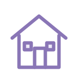

<!-- Profile assets live in the assets/ folder at the root of this repository. -->

  <picture>
    <source media="(prefers-color-scheme: dark)" srcset="assets/name-dark.gif">
    <source media="(prefers-color-scheme: light)" srcset="assets/name-light.gif">
    
  </picture>

  <strong>Computer Science student at the University of L'Aquila</strong> 
  Building thoughtful software · Exploring backend and cloud computing

  <a href="https://github.com/raworld26?tab=repositories">Explore my projects</a> ·
  <a href="mailto:mattia.ramondo2004@gmail.com">Get in touch</a>

<h2 align="center">About me</h2>

I enjoy the part of software development where an idea becomes a clear design, working logic, and an interface people can use. I'm studying Computer Science at the **University of L'Aquila**, with a growing focus on **Java and backend development**.

In university teams, I've contributed to software design and diagrams, backend and application logic, and interface styling. I also helped fix backend issues and update content for a university website. I'm currently learning more about **Docker, CI/CD, and cloud computing**.

<h2 align="center">Toolbox</h2>

<h3 align="center">Languages &amp; web</h3>

  <picture>
    <source media="(prefers-color-scheme: dark)" srcset="https://skillicons.dev/icons?i=java,php,js,html,css&amp;theme=dark">
    <source media="(prefers-color-scheme: light)" srcset="https://skillicons.dev/icons?i=java,php,js,html,css&amp;theme=light">
    
  </picture>

<h3 align="center">Data &amp; build</h3>

  <picture>
    <source media="(prefers-color-scheme: dark)" srcset="https://skillicons.dev/icons?i=mysql,sqlite,maven&amp;theme=dark">
    <source media="(prefers-color-scheme: light)" srcset="https://skillicons.dev/icons?i=mysql,sqlite,maven&amp;theme=light">
    
  </picture>

<h3 align="center">Workflow &amp; operating system</h3>

  <picture>
    <source media="(prefers-color-scheme: dark)" srcset="https://skillicons.dev/icons?i=git,github,mint&amp;theme=dark">
    <source media="(prefers-color-scheme: light)" srcset="https://skillicons.dev/icons?i=git,github,mint&amp;theme=light">
    
  </picture>

<h2 align="center">Selected projects</h2>

University team projects. My work has included design and diagrams, backend or application logic, and interface styling; the exact contribution varies by project.

<h3 align="center"><a href="https://github.com/raworld26/unigest">UniGest</a></h3>

A desktop application for exam sessions, bookings, and grades. Java 21 · JavaFX · Maven · Jackson · JSON

 

<h3 align="center"><a href="https://github.com/raworld26/MasterRent">MasterRent</a></h3>

A university housing portal with filtered search and areas for students, owners, and administrators. PHP · MySQL/MariaDB · HTML · CSS · JavaScript

 

<h3 align="center"><a href="https://github.com/raworld26/MasterDump">MasterDump</a></h3>

A web portal for purchase requests, approvals, and technician assignments. PHP · MySQL · HTML · CSS

Another project

**[SafeDriveMonitor](https://github.com/raworld26/SafeDriveMonitor)** · An educational desktop prototype for simulated tests, user accounts, results, and an admin panel. Java, JavaFX, Maven, and SQLite.

<h2 align="center">Let's connect</h2>

Interested in software engineering, Java, or building something together? <a href="mailto:mattia.ramondo2004@gmail.com">Email me</a> · <a href="https://github.com/raworld26?tab=repositories">Browse my repositories</a>

