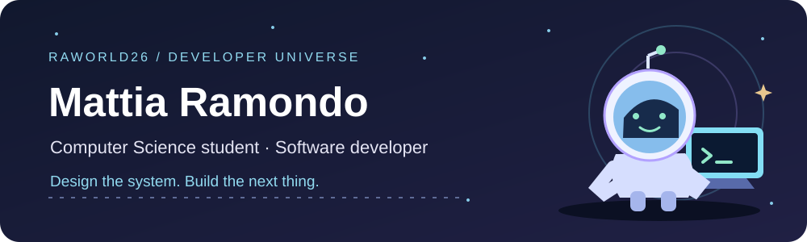
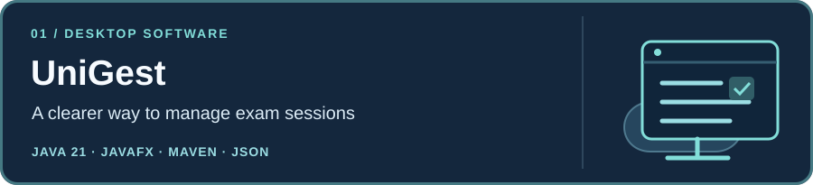
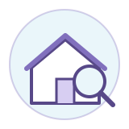
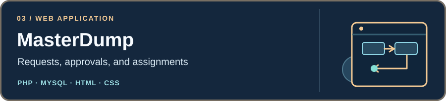

<!-- Mattia Ramondo · profile README · assets are stored in this repository. -->

  

<h1 align="center">Hi, I'm Mattia 👋</h1>

<strong>Computer Science student at the University of L'Aquila</strong> Building useful software, one well-considered decision at a time.

  <a href="https://github.com/raworld26?tab=repositories">Explore my code</a> ·
  <a href="mailto:mattia.ramondo2004@gmail.com">Get in touch</a>

## 🪐 About this universe

I study Computer Science and enjoy turning a rough idea into a clear design, working code, and a usable interface. In university teams, I've worked on diagrams and software design, backend and application logic, and interface styling. I've also supported backend fixes and content updates for a university website.

My current focus is **Java and backend development**. I use **Git, SQL, and Linux Mint** for coursework and projects, and I'm exploring what comes next in **DevOps and cloud computing**.

## 🧰 Tools in my orbit

**Programming & web** · Java · PHP · SQL · JavaScript · HTML · CSS  

**Data & desktop** · MySQL / MariaDB · JavaFX · Maven  

**Workflow** · Git · GitHub · Linux Mint  
  
On Linux Mint, I'm comfortable navigating files, managing packages, and building and running programs from the terminal.

> **Next to explore:** deeper Java backend work → Docker and DevOps fundamentals → CI/CD → cloud computing. These are learning goals, not claims of professional experience.

## 🚀 Featured missions

These are **university team projects**. My contributions have centered on design and diagrams, backend or application logic, and interface styling; the exact work varies by project.

**[UniGest](https://github.com/raworld26/unigest)** · A desktop app that helps students, lecturers, and administrators manage exam sessions, bookings, and grades. Built with Java 21, JavaFX, Maven, Jackson, and JSON storage.

**[MasterRent](https://github.com/raworld26/MasterRent)** · A web portal for university housing: filtered search, property management, and dedicated areas for students, owners, and administrators. Built with PHP, MySQL/MariaDB, HTML, CSS, and JavaScript.

**[MasterDump](https://github.com/raworld26/MasterDump)** · A web system that organizes purchase requests, product approvals, and technician assignments using a relational database. Built with PHP, MySQL, HTML, and CSS.

One more project in the hangar

**[SafeDriveMonitor](https://github.com/raworld26/SafeDriveMonitor)** · An educational desktop prototype for simulated tests, user accounts, results, and an admin panel. Java, JavaFX, Maven, and SQLite.

## 📡 Let's connect

Interested in software engineering, Java, or building something together? **[Email me](mailto:mattia.ramondo2004@gmail.com)** or **[browse my repositories](https://github.com/raworld26?tab=repositories)**.

